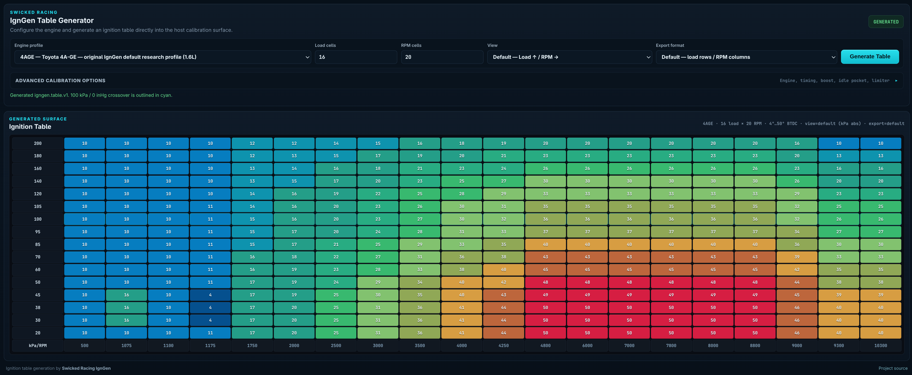
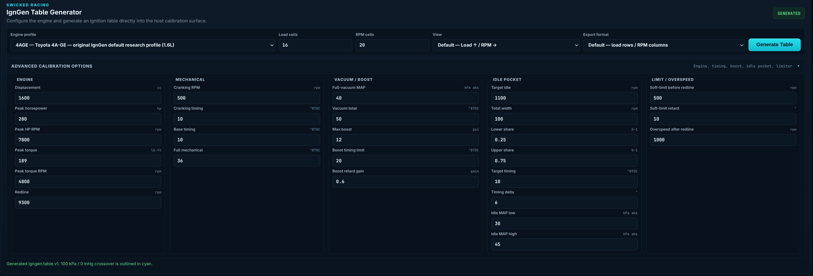

# Swicked Racing IgnGen

IgnGen is an ignition timing table generator for creating **explainable starting calibration maps** from a small set of engine and calibration parameters.

It is designed around the behavior of a well-developed distributor-style ignition system:

- an RPM-driven mechanical advance curve
- vacuum advance below atmospheric pressure
- boost retard above atmospheric pressure
- a protected idle timing pocket
- a configurable high-RPM soft-limit / overspeed region
- nonlinear RPM and load-axis generation that preserves important engine landmarks

IgnGen includes both a command-line interface and a compact browser/desktop GUI intended to make table generation easy to use standalone and easy to integrate into other tuning applications.

## GUI Preview



*IgnGen showing the main engine/profile controls and generated ignition timing surface.*

### Advanced calibration options



*Expanded calibration controls for engine landmarks, mechanical timing, vacuum/boost, idle pocket, and limiter/overspeed settings.*

> **Calibration warning**
>
> IgnGen generates starting calibration tables, not guaranteed engine-safe prescriptions. Final ignition timing must be verified on the actual engine with appropriate instrumentation, fuel-quality controls, knock monitoring, and dyno/road testing. The user is responsible for the resulting calibration and engine operation.

---

## Quick start

### Requirements

- Python 3.10 or newer
- Linux, Windows, or another platform capable of running Python

Clone the repository and install it in editable mode:

```bash
git clone https://github.com/Swicked86/Swicked_Racing-IgnGen.git
cd Swicked_Racing-IgnGen
python -m pip install -e .
```

For development and testing:

```bash
python -m pip install -e ".[dev]"
pytest -q
```

---

## GUI

The GUI is the easiest way to use IgnGen.

### Browser mode

This has no GUI dependency beyond Python itself:

```bash
igngen-gui --browser
```

IgnGen starts a local HTTP service bound to localhost and opens the interface in the default browser.

### Desktop-window mode

Install the optional desktop GUI dependency:

```bash
python -m pip install -e ".[gui]"
igngen-gui
```

IgnGen uses `pywebview` when available and falls back to the browser if it is not installed.

The same HTML/CSS/JavaScript interface is used on Linux and Windows, which also provides a straightforward path for embedding the generator into a Python/webview-based tuning application.

### GUI workflow

The main panel exposes the normal generation workflow:

1. Select an engine profile.
2. Select load-cell and RPM-cell counts.
3. Select the display view.
4. Select the export format.
5. Click **Generate Table**.

Detailed engine/calibration values are kept under the expandable **Advanced calibration options** section.

The generated ignition table appears directly below the configuration panel.

### Display views

**Default** is the normal IgnGen view:

```text
Load increases bottom -> top
RPM increases left -> right
Load unit: kPa absolute
```

**Alpha** transposes the displayed table into an RPM-row / load-column layout and converts the displayed load axis to gauge-style inHg:

```text
vacuum: negative inHg
atmosphere: approximately 0 inHg
boost: positive inHg
```

The internal timing calculation always remains in **kPa absolute**. Display-unit conversion does not change the timing calculation.

---

## Command-line usage

Running IgnGen with no arguments launches the normal interactive table-generation workflow:

```bash
igngen
```

This is equivalent to:

```bash
igngen new
```

The interactive workflow steps through:

```text
Select engine
    ↓
Review / edit engine defaults
    ↓
Select table preset
    ↓
Select display layout
    ↓
Select export format
    ↓
Select output filename
    ↓
Generate timing table
    ↓
Display generated table
```

### Useful commands

List engine profiles:

```bash
igngen engines
```

List table presets:

```bash
igngen presets
```

Generate a table non-interactively:

```bash
igngen new \
  --engine D16Z6 \
  --preset base \
  --show
```

Generate and export directly to a CSV file:

```bash
igngen new \
  --engine D16Z6 \
  --preset base \
  --export default \
  --out d16z6-ignition.csv
```

Generate an Alpha-oriented CSV with RPM rows and load columns:

```bash
igngen new \
  --engine 4age \
  --preset alpha \
  --export alpha \
  --out 4age-alpha-ignition.csv
```

`--out` selects the output filename. A `.csv` filename writes CSV. `--export default` writes load rows with RPM columns; `--export alpha` writes RPM rows with load columns.

Example boosted generation:

```bash
igngen new \
  --engine 4age \
  --boost-psi 12 \
  --boost-retard-gain 0.60 \
  --out 4age-12psi.csv \
  --show
```

View an existing table:

```bash
igngen show map.csv
```

Additional table utilities are available through:

```bash
igngen bump
igngen clamp
igngen convert
```

Use `--help` on IgnGen or any subcommand for the complete option list:

```bash
igngen --help
igngen new --help
```

---

## Engine profiles

Engine defaults are stored as human-readable INI files in:

```text
engines/
```

Profiles contain engine landmarks and starting calibration values. They are intended to provide sensible defaults that a tuner can review and override for a specific engine.

Current calibration inputs include:

### Engine landmarks

- displacement
- peak horsepower and RPM
- peak torque and RPM
- redline RPM
- maximum boost pressure
- target idle RPM

### Mechanical timing

- cranking RPM
- cranking timing
- base / initial timing
- full mechanical timing at peak torque

### Vacuum timing

- full-vacuum MAP endpoint
- absolute total timing at full vacuum

### Boost timing

- absolute boost timing limit
- boost-retard gain

The tuner specifies the **absolute total timing limit**, not a degrees-per-psi retard amount.

The default boost-retard gain is:

```text
0.60
```

It is stored even in naturally aspirated profiles so that changing only the configured maximum boost pressure immediately produces a usable boosted starting table.

### Idle pocket

- total RPM width
- lower / upper share
- target timing
- timing delta
- idle MAP low / high limits

### Limiter / overspeed

- soft-limit distance before redline
- soft-limit retard
- overspeed distance above redline

---

## Timing model

### 100 kPa atmospheric master curve

**100 kPa absolute is always the pressure crossover and master timing curve.**

At 100 kPa:

```text
pressure correction = 0
commanded timing = mechanical RPM curve
```

The mechanical curve progresses conceptually as:

```text
cranking
   ↓
base / initial timing
   ↓
mechanical advance with RPM
   ↓
full mechanical timing near peak torque
```

### Vacuum advance

Below 100 kPa, timing advances toward the configured full-vacuum total timing.

Example:

```text
100 kPa -> mechanical timing
 40 kPa -> configured full-vacuum total timing
```

Vacuum advance is phased with mechanical-curve progress so the complete high-RPM vacuum addition is not applied indiscriminately at low RPM.

### Boost retard

Above 100 kPa, the vacuum pressure scale is mirrored into boost and scaled by the configured boost-retard gain.

With a normal full-vacuum endpoint of 40 kPa:

```text
100 - 40 = 60 kPa vacuum span
```

At a boost-retard gain of `1.0`, that pressure span mirrors directly:

```text
100 -> 160 kPa
```

The normal IgnGen starting gain is `0.60`, so the same timing-limit progression is spread over a larger boost-pressure range:

```text
100 + (60 / 0.60) = 200 kPa absolute
```

The configured boost timing limit remains an **absolute total timing endpoint**. IgnGen calculates the required retard internally.

The model deliberately uses indicated MAP directly for this calibration curve. It does not attempt to convert MAP into an oxygen-equivalent or compressor-efficiency-adjusted load before generating the base timing surface.

### Idle timing pocket

The idle pocket is a protected local region around the configured idle RPM and idle MAP range.

Its purpose is to use ignition torque for idle stabilization:

```text
below target idle -> more timing / catch RPM
at target idle    -> target idle timing
above target idle -> less timing / remove torque
```

The pocket has priority over the generic pressure surface inside its configured region.

### High-RPM soft limit

IgnGen can begin progressively removing timing before redline so the engine develops a noticeable torque reduction before the hard limit.

The generated RPM axis continues beyond redline into an overspeed region so interpolation remains defined during RPM overshoot.

---

## Axis generation

IgnGen treats axis generation as part of the calibration model rather than simple formatting.

### RPM axis landmarks

Important candidates include:

- cranking RPM
- idle-pocket lower edge
- target idle RPM
- idle-pocket upper edge
- peak torque RPM
- peak horsepower RPM
- soft-limit start
- redline
- overspeed endpoint

Remaining RPM cells are allocated into useful regions and snapped to readable values.

### Load axis landmarks

Important candidates include:

- one structural deceleration row below the normal idle MAP region
- idle MAP landmarks
- vacuum/cruise regions
- **100 kPa atmosphere — mandatory**
- boost-pressure landmarks
- maximum configured boost
- overboost/headroom region

Load is calculated internally in kPa absolute.

---

## Internal table representation

The canonical representation is:

```text
RPM axis:  ascending
Load axis: ascending kPa absolute
Values:    timing[rpm_index][load_index]
```

Display orientation and export orientation are separate from this representation.

This allows IgnGen to generate one canonical timing surface and adapt it to different ECU/table conventions without changing the timing calculation.

---

## Application integration

IgnGen exposes a small Python integration boundary for host applications:

```python
from igngen.gui_app import generate_payload

result = generate_payload({
    "engine": "d16z6",
    "boost_psi": 12,
    "boost_retard_gain": 0.60,
    "load_cells": 16,
    "rpm_cells": 20,
    "view": "default",
    "export": "default",
})
```

The response contains the canonical axes and timing surface:

```python
{
    "schema": "igngen.table.v1",
    "rpm": [...],
    "load_kpa": [...],
    "load_inhg_gauge": [...],
    "timing": [...],
    "export_table": {...},
    "attribution": {...},
}
```

The canonical timing array uses:

```text
timing[rpm_index][load_index]
```

The GUI exposes the same generator through a localhost HTTP endpoint:

```text
POST /api/generate
```

This is intended to make integration possible without coupling another application's table editor, calibration-file handling, undo/redo system, or ECU communications to IgnGen internals.

The intended responsibility boundary is:

```text
host application
    ↓
provides table dimensions / generator inputs
    ↓
IgnGen
    ↓
generates RPM axis + load axis + absolute crank timing surface
    ↓
host application
    ↓
imports / displays / edits / saves the calibration
```

See:

```text
docs/ALPHALINK_INTEGRATION.md
```

for the current integration notes and Windows/webview path.

---

## Project layout

```text
src/igngen/
├── calibration.py     # canonical timing model + axis generation + engine profiles
├── cli.py             # command-line application
├── prompts.py         # interactive calibration workflow
├── gui_app.py         # GUI launcher + integration API
├── gui/               # HTML/CSS/JavaScript GUI
├── table.py           # timing-table representation
├── io_files.py        # import/export helpers
└── units.py           # kPa / inHg conversion helpers

engines/               # engine profile INI files
presets/               # table-size/layout presets
tests/                 # automated tests
docs/                  # integration and design documentation
```

---

## Development

Linux/macOS:

```bash
python -m venv .venv
source .venv/bin/activate
python -m pip install -e ".[dev,gui]"
pytest -q
```

Windows PowerShell:

```powershell
py -m venv .venv
.\.venv\Scripts\Activate.ps1
python -m pip install -e ".[dev,gui]"
pytest -q
```

Before submitting changes, run the complete test suite and verify both:

```bash
igngen
igngen-gui --browser
```

---

## Release status

IgnGen is under active development. The timing backend, interactive CLI, engine profiles, GUI, default/Alpha table views, unit conversion, export orientation, integration payload, and automated tests are present and usable for evaluation.

Before treating a generated table as a final calibration, validate it on the target engine.

Contributions, engine-profile corrections, exporter work, integration testing, and calibration-model review are welcome.

---

## License and attribution

IgnGen is released under the **Swicked Racing Attribution License 1.0** contained in [`LICENSE`](LICENSE).

The license permits use, modification, redistribution, commercial use, binary integration, and incorporation into larger applications, subject to its attribution requirements.

Applications incorporating IgnGen or a material portion of its ignition-table generation logic must make the following attribution reasonably accessible in the normal user interface:

```text
Ignition table generation by Swicked Racing IgnGen
https://github.com/Swicked86/Swicked_Racing-IgnGen
```

The attribution does not need to be continuously displayed or more prominent than comparable third-party technology credits. See `LICENSE` and `NOTICE` for the complete terms and required notice.

---

## Attribution

**Swicked Racing IgnGen**  
Ignition table generation by Swicked Racing IgnGen  
https://github.com/Swicked86/Swicked_Racing-IgnGen
